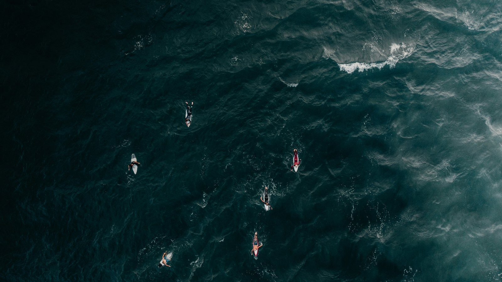
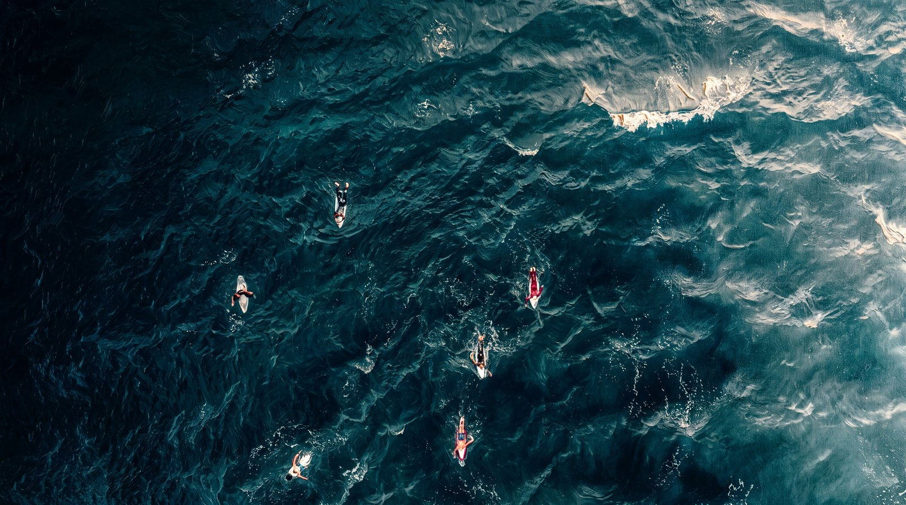
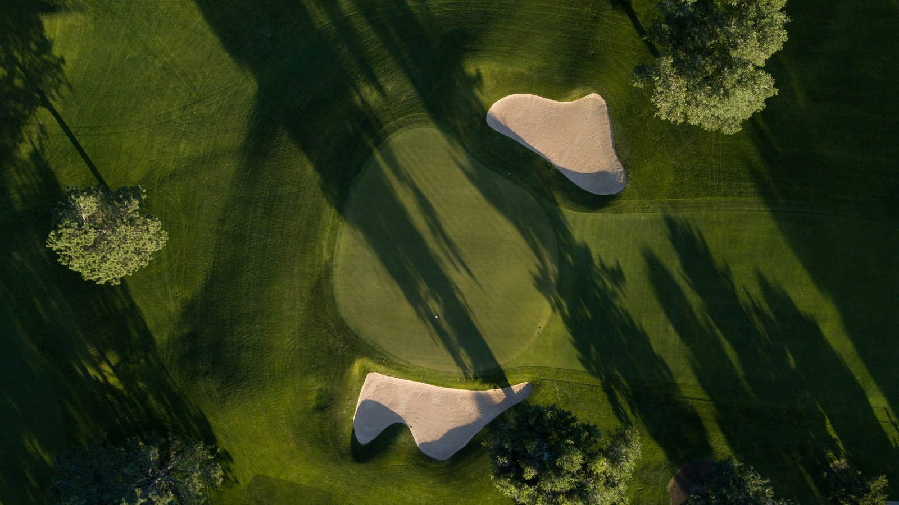
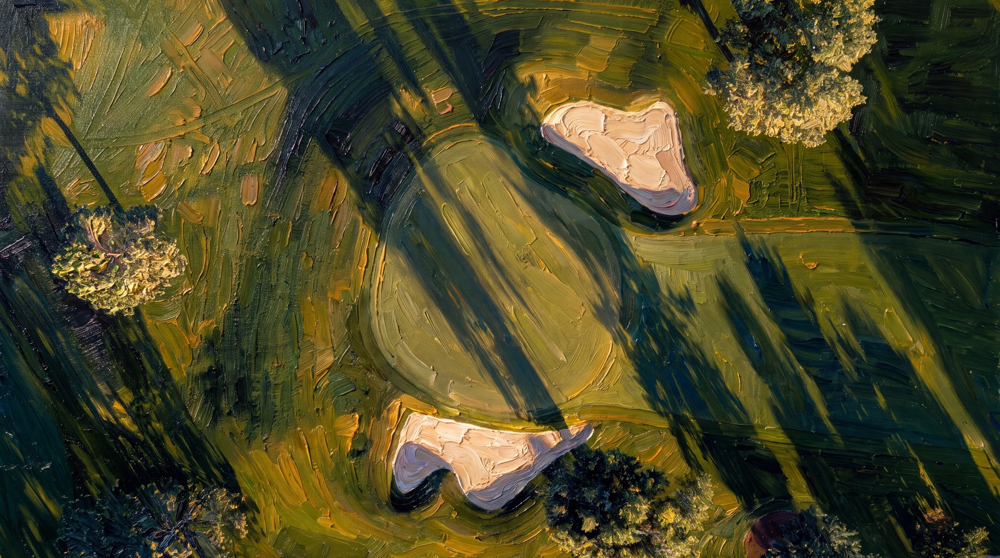
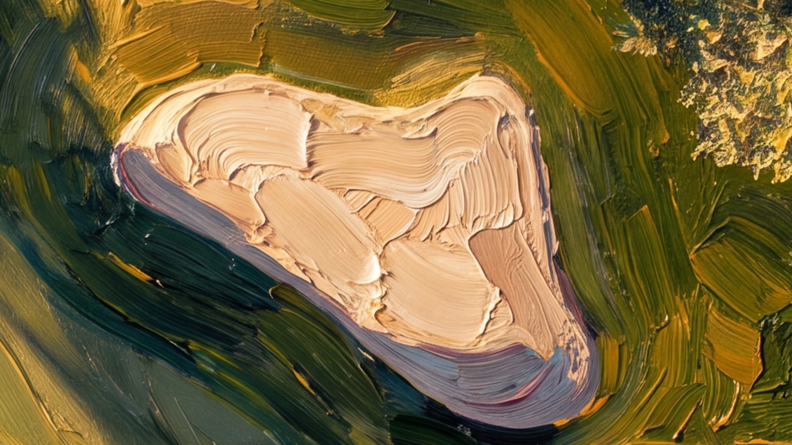
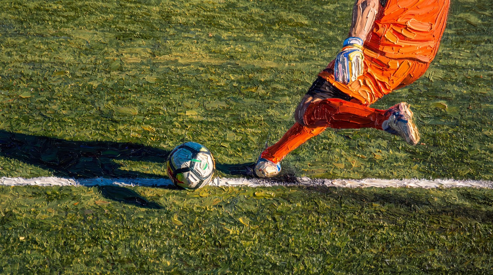
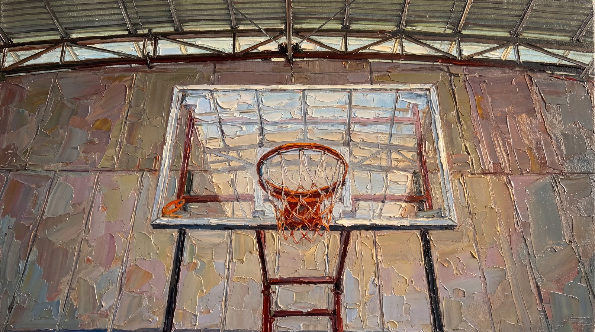
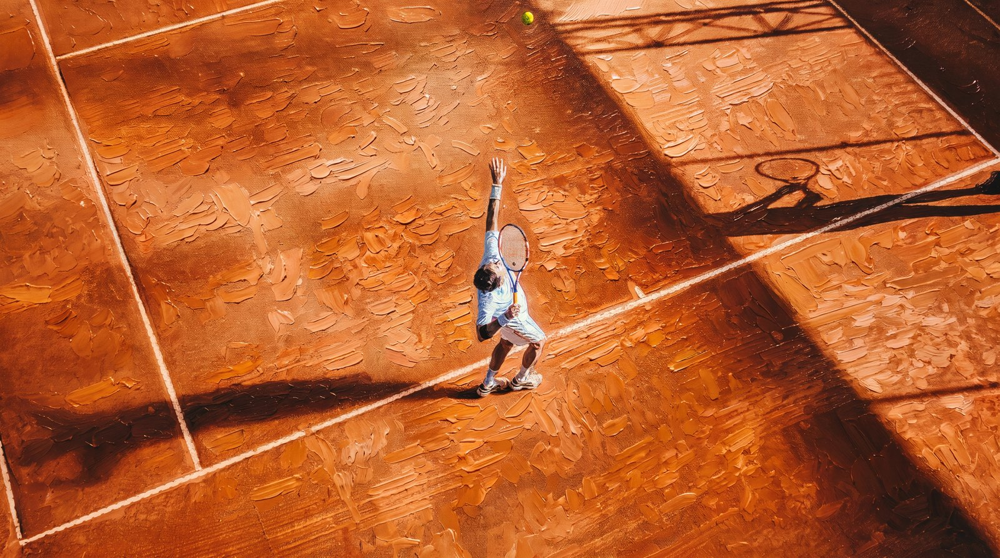

# Impasto — oil-paint wallpaper pipeline

Turns a folder of photographs into gallery-grade oil-paint wallpapers at 4K, then cuts
them into desktop (16:9) and iPhone (9:16) deliverables.

The repaint is **image-to-image**, never text-to-image. The photograph supplies
composition, proportion and light; the model only rewrites the *surface* into thick
hand-applied paint. That single constraint is what separates this from the smooth
digital slop a blank prompt produces.

A personal project, built to see how far a disciplined prompt structure and careful
source selection could push a generative model toward something that reads as a real
painted object rather than a filter.

## Gallery

### The full chain, end to end

One image carries every stage: a drone photograph, repainted at 4K, then animated into a
living painting.

| Source photograph | Repainted at 4K |
|---|---|
|  |  |

**▶ [Watch the 7-second animation](samples/Boat01_oil_video.mp4)** — GitHub plays it
inline when you open the file. The water shimmers and the surfers drift with the swell
while the camera holds completely still; the brushwork and canvas weave stay put.

This is deliberately the *hardest* case in the pack, and it's instructive. Close-up
overhead water fills the frame with fine detail, and the model preserves detail rather
than abstracting it — so the paint here is far subtler than elsewhere, closer to a
painterly treatment than to thick impasto. It earns its place as the hero because that
same dense surface makes it the best subject for motion, and because it is the one image
that runs the whole pipeline.

### Where the paint is most convincing

Broad, simple surfaces are what the style block was built for. This is the same render
at 100%, straight from 5504×3072 — palette-knife ridges catching the light, canvas weave
showing through the thinner passages:

| Source photograph | Repainted at 4K |
|---|---|
|  |  |



### Range

Three more from the same pack, each testing a different kind of scene:

| Action and figures | Built structure | Aerial and raking light |
|---|---|---|
|  |  |  |
| Orange kit on green turf — a true complementary pair, and turf takes impasto beautifully | The flat wall was expected to be too dull to paint; it became broad palette-knife slabs and carries the picture | Clay reduced to dabbed strokes, with the shadow diagonal preserved intact |

Every source photograph and the exact prompt that produced each render are in
[`samples/`](samples/).

## How it works

```
Input_Images/<pack>/            your photographs (jpg / png / heic)
        │
        │  prepare_sources.sh — pre-crop to the target aspect ratio
        ▼
Input_Prepared/<pack>/          sources already at 16:9
        │
        │  Stage 1  an agent views each photo and writes a tailored prompt
        │  Stage 2  Higgsfield `generate_image` (Nano Banana Pro), image-to-image
        ▼
Processed_Images/<pack>/        <name>_oil.png at 4K  +  <name>_prompt.txt sidecar
        │
        │  make_deliverables.py — watermark + pan-and-scan
        ▼
Deliverables/Photos/<pack>/     Desktop_16x9/  and  iPhone_9x16/
```

Two stages do the real work:

**Stage 1 — vision to prompt.** An agent (Claude Code, via native vision) opens each
photograph and writes a prompt in two parts. Part A is one variable sentence naming the
actual scene. Part B is a fixed style block appended verbatim from
[`style_block.txt`](style_block.txt). Splitting them is what keeps the style from
drifting across a pack — only the scene sentence flexes.
[`style_block_cool.txt`](style_block_cool.txt) is the same block minus the warm-light
clause, for images that must keep a cool or blue mood.

**Stage 2 — repaint.** The prepared source is uploaded to Higgsfield
(`media_upload` → PUT bytes → `media_confirm`), then passed to `generate_image` with
model `nano_banana_pro` as the image-to-image input. The upload path is fully
scriptable, so a pack runs unattended.

### Why sources are pre-cropped

Image-to-image non-uniformly scales the source to fill the requested `aspect_ratio`,
which squishes the geometry. Feeding a source already at the target ratio leaves the
model no reshaping to do. That is the whole job of `prepare_sources.sh`.

## Usage

```bash
./prepare_sources.sh Prod01_IMG/Sports 16 9 center
```

Then run the repaint (Stage 1 + 2 are driven by the agent against the Higgsfield MCP),
and finish the pack:

```bash
/usr/bin/python3 make_deliverables.py \
    --src Processed_Images/Prod01_IMG/Sports_02 \
    --out Deliverables/Photos/Prod01_Sports \
    --pan packs/prod01_sports.pan.json
```

Add `--watermark` to composite the Impasto mark into the bottom-right of the 16:9
output. The phone crops are always left clean.

Pan offsets live in `packs/*.pan.json` as the left-edge x of the 9:16 crop in source
pixels, chosen by eye per image so the subject survives the crop. Any name missing from
the file is centre-cropped.

> **macOS note:** use `/usr/bin/python3`. The system interpreter ships with Pillow 11.3
> already installed; the Homebrew and python.org interpreters on this machine do not
> have it. Otherwise `pip install -r requirements.txt`.

## Costs

Measured against Higgsfield Plus credits.

| Job | Config | Credits |
|---|---|---|
| Repaint, 2K | `nano_banana_pro` | 2 / image |
| Repaint, 4K | `nano_banana_pro` | 4 / image |
| Video, 1080p | Seedance 2.0, 7s, silent, high bitrate | 63 |
| Video, 4K | Seedance 2.0, 7s, silent, high bitrate | 154 |
| Video, cheap | Kling 3.0 pro, 5s, silent | 8.75 |

A 12-image pack costs 48 credits at 4K. Kling is ~7× cheaper than Seedance for video
but destroys the impasto texture — see [field notes](docs/field-notes.md#video).

## Repo layout

```
prepare_sources.sh          pre-crop sources to the target aspect ratio
make_deliverables.py        16:9 + 9:16 finishing, optional watermark
style_block.txt             fixed Part B of the prompt (warm)
style_block_cool.txt        same, minus the warm-light clause
packs/*.pan.json            per-image 9:16 pan offsets
samples/                    before/after pairs, their prompts, and the video
docs/field-notes.md         what works, what fails, and why
docs/phase-1-brief.md       the original build spec
LICENSE                     MIT, covering code and docs only
```

The image working folders (`Input_Images/`, `Input_Prepared/`, `Processed_Images/`,
`Deliverables/`) are **not tracked** — they run to ~1.7 GB and the renders are
reproducible from the sidecar prompts. Only `samples/` is committed.

## Status

Phase 1 is complete: folder in, 4K oil-paint stills out, cut to two delivery formats.

- **Prod01 Sports** — 12/12 rendered at 5504×3072, cut to both formats.
- **Video** — Seedance 2.0 holds the paint texture, Kling destroys it. 1080p at 7s is
  the config that stays affordable without losing the brushwork; the sample above was
  rendered at 4K and downscaled for this repo.
- **Next packs** — Villa (should run clean: sunlit, broad surfaces) and Larp (needs
  generated bases for the watches and cars).

## License and source material

The code, prompts and documentation in this repository are MIT licensed — see
[LICENSE](LICENSE).

The **photographs are not**. Sample sources are included only to show what the pipeline
receives as input, and the rights in them belong to their original photographers. This is
a non-commercial personal project; nothing here is produced for sale.

If you fork this to run on your own images, use photographs you took or hold rights to.
Worth knowing if you ever point it at stock: a lot of arena and event photography is
licensed *editorial use only*, which restricts commercial reuse independently of any
trademark question.
